# 
 多智能体强化学习 

## 
 目录 

### L1 Dynamic Programming
### L2 Value Esitimation
  
  
  
  
  
  

## 
 L1 Dynamic Programming 

### 
 MDP建模

- **概述：** 一个问题是否可以通过强化学习的方式解决，取决于该问题是否可以被抽象建模为马尔科夫决策过程或其变化过程，即明确马尔科夫决策过程的各个组成要素
- **随机过程：** 是概率论的“动力学”部分。概率论的研究对象是静态的随机现象，而随机过程的研究对象是随时间演变的随机现象，例如天气随时间的变化、城市交通随时间的变化等。
    - 在随机过程中，随机现象在某时刻 $𝑡$ 的取值是一个向量随机变量，用 $𝑆_t$ 表示，所有可能的状态组成状态𝑆集合。
    - 随机现象便是状态的变化过程。在某时刻 $𝑡$ 的状态 $𝑆_t$ 通常取决于 $𝑡$ 时刻之前的状态。我们将已知历史信息 $(S_1,...S_t)$ 时下一个时刻状态为 $𝑆_t+1$ 的概率表示为 $(S_{t+1}|S_1,...S_t)$。
- **马尔科夫性质：** 当且仅当某时刻的状态只取决于上一时刻的状态时，一个随机过程被称为具有马尔可夫性质$（Markov\ property）$
    - $P(S_{t+1}|S_t)=P(S_{t+1}|S_1,...S_t)$
    - 当前状态是未来的充分统计量，即下一个状态只取决于当前状态，而不会受到过去状态的影响。
- **马尔科夫过程：** 指具有马尔可夫性质的随机过程，也被称为马尔可夫链$（Markov\ chain）$，通常可以用元组 $< 𝑆, 𝑃 > $ 来描述。
    - $𝑆$ ：有限数量的状态集合；
    - $𝑃$ ：状态转移矩阵；
    - 假设一共有 $𝑛$ 个状态，即$S=\{s_1,s_2...s_n\}$，状态转移矩阵 $𝑃$ 定义了状态之间的转移概率，即：
    - $$
    P = \begin{bmatrix}
    P(s_1, s_1) & \cdots & P(s_n, s_1) \\
    \vdots & \ddots & \vdots \\
    P(s_1, s_n) & \cdots & P(s_n, s_n)
    \end{bmatrix}
    $$
    - 其中：$P_{(S_i,S_j)}=P(S_{t+1}=S_j|S_t=S_i)$

- **MDP建模**
    - 马尔科夫过程
    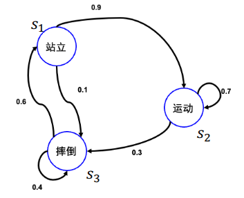
    - 其状态转移矩阵为：$$P=\begin{bmatrix}
    0 & 0.9 & 0.1\\
    0 & 0.7 & 0.3\\
    0.6 & 0 & 0.4
    \end{bmatrix}$$
    - 给定一个马尔科夫过程，从某个状态出发，根据它的状态转移矩阵生成一个状态序列 $(episode)$ ，这个步骤称之为采样 $(sampling)$.
- **马尔科夫奖励过程：** 马尔科夫过程的基础上增加奖励函数和折扣因子，即得到马尔科夫奖励过程 $(Markov\ reward\ process)$ ，通常可以用元组$<S,P,r,\gamma>$
    - $S:$ 有限数量的状态集合
    - $P:$ 状态转移矩阵
    - $r:$ 奖励函数，进入到某个状态 $s$ 时，智能体得到的奖励 $r(s)$.
    - $\gamma:$ 折扣因子，通常取值范围为 $[0,1]$ ，对未来远期奖励进行惩罚。
- **回报：** 在一个马尔科夫奖励过程中，从 $𝑡$ 时刻的状态 $𝑆_t$ 开始，直到一个回合结束的终止状态，或有限的视野内，所有奖励的折扣累计和被成为回报 $𝐺_t(return)$ ，其公式为：
$G_t=R_t+\gamma R_{t+1}+\gamma^2 R_{t+2}+...=\sum_{k=0}^n \gamma^k R_{t+k}$
$G_t=R_t+\gamma R_{t+1}+\gamma^2 R_{t+2}+...\gamma^nV_{t+n}=\sum_{k=0}^n \gamma^k R_{t+k}+\gamma^nV_{t+n}$
- **MRP机器人案例：** 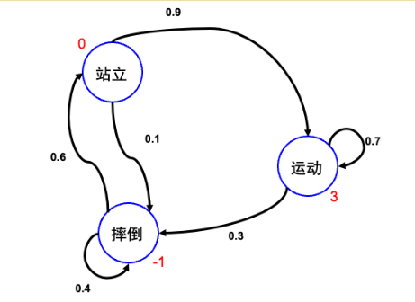
    - 假设折扣因子为0.9
    - 假设其采样轨迹为：
        - 站立，站立，运动，运动，摔倒
        - 站立，运动，摔倒，站立
        - 站立，摔倒，站立，运动，运动
    - 则其回报分别为：$3.9609,\ 1.89,\ 3.2553$
- **价值函数V：** 马尔科夫奖励过程中，一个状态的期望回报被成为该状态的价值，所有的状态的价值的集合为价值函数，即价值函数 $𝑉(𝑠)$ 以状态作为输入，以其期望回报为输出。
    - 该价值函数可以写成为：$V(s)=E[G_t|S_t = s]$
    - 将该函数展开：
    $ V(s)=E[G_t|S_t = s]$
    $=E[R_t+\gamma R_{t+1}+\gamma^2 R_{t+2+...}|S_t=s]$
    $=E[R_t+\gamma(R_{t+1}+\gamma R_{t+2+...})|S_t=s]$
    $=E[R_t+\gamma V(s_{t+1})|S_t=s]$
    $=r(s)+\gamma \sum_{s'\in S}p(s'|s)V(s')$
- **MRP闭式解：** 在马尔科夫奖励过程中，如果将状态价值表示为列向量，将奖励函数表示为列向量，则可以将马尔科夫奖励过程表示为矩阵模式，并通过矩阵运算求解闭式解，即：
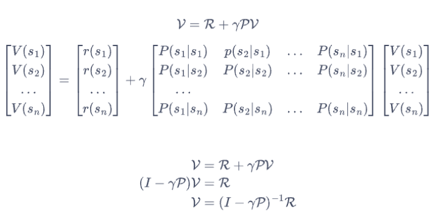
- **MDP建模：** 在马尔科夫过程和马尔科夫奖励过程都是环境驱动的自发改变的随机过程，是不受智能体控制的随机过程；在马尔科夫奖励过程中加入行为，就得到了马尔科夫决策过程$(Markov\ Decision\ Process,\  MDP)$，MDP由5个元素组成$M =< S, A, P, R, \gamma >$
    - $S$: 状态集合
    - $A$: 行为集合
    - $P$: 状态转移函数，$𝑝(𝑠'|𝑠,𝑎)$ 取决于状态和行为
    - $R$: 奖励函数，$𝑟(𝑠,𝑎)$取决于状态和行为，如果只取决于状态则退化到$𝑟(𝑠)$
    - $\gamma$: 未来奖励折扣因子。
    - 智能体 $(agent)$ 在一个环境 $(environment)$ 中执行动作/行为(action)。环境如何对智能体的动作做出响应由一个已知或未知的模型 $(model)$ 来定义。执行智能体可以停留在环境中的某个状态 $(state)$ $𝒔 \in 𝑺$，可以通过执行某个行为/动作 $(action)$ $𝒂\in 𝑨$来从一个状态 $s$ 进入到另一个状态 $s'$ 。智能体会到达什么状态由状态转移概率 (𝑃) 决定。智能体执行了一个动作之后，环境会给出一定的奖励(reward) $𝒓 \in 𝑹$作为反馈。
    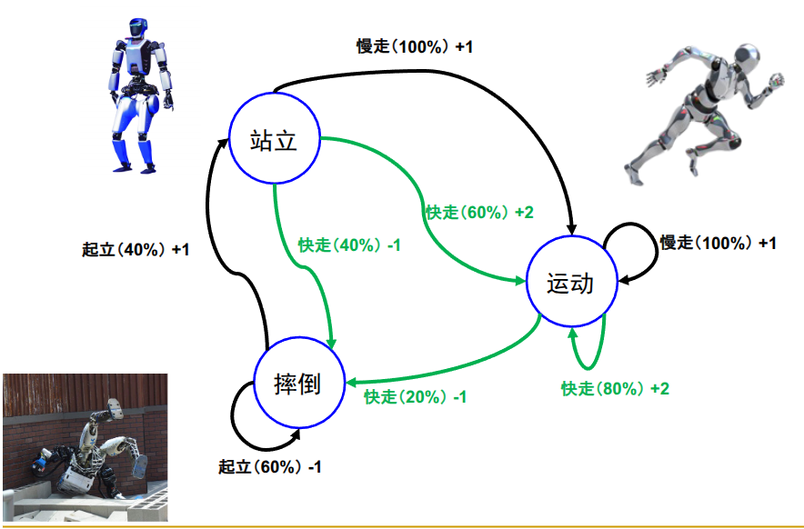
- **策略：**
    - 智能体的策略 $（Policy）$ 通常用字母𝜋表示。策略$\pi(a|s)=P(A_t=a|S_t=s)$是一个函数，表示在输入状态 s 情况下采取动作 a 的概率。
    - 当一个策略是确定性策略 $（deterministic\ policy）$ 时，它在每个状态时只输出一个确定性的动作，即只有该动作的概率为1，其他动作的概率为0；
    - 当一个策略是随机性策略 $（stochastic\ policy）$ 时，它在每个状态时输出的是关于动作的概率分布，然后根据该分布进行采样就可以得到一个动作。
- **MDP价值：** 马尔科夫决策过程相比于马尔科夫奖励过程增加了智能体策略，因此在MDP问题建模中，状态的价值不仅取决于状态本身，还取决于智能体采用什么策略。
    - 参考MRP的价值函数定义与推导，MDP的状态价值函数为：
    $V_\pi(s)=E_\pi[G_t|S_t=s]$
    $V_\pi(s)=E_\pi[R_t+\gamma V^\pi(S_{T+1}|S_t=s)]$
    - 由于MDP中的行为存在，我们还需要定义一个状态-行为价值函数 (state-action value)，$Q^\pi(s,a)$为智能体在状态𝑠时，遵循策略 $\pi$ 采取了行为 a 时得到的期望回报：
    $Q^\pi(s,a)=E_\pi[G_t|S_t=s,A_t=a]$
    - 在使用策略 $\pi$ 的前提下，状态 $𝑠$ 的价值等于智能体在该状态下采取所有动作的概率与相应状态-行为价值的乘积求和结果：
    $V^\pi(s)=\sum_{a\in A}\pi(a|s)Q^\pi(s,a)$
    - 在使用策略 $\pi$ 的前提下，状态 $s$ 下采取行为 $a$ 的价值等于顺势奖励加衰减后的所有可能的下一个状态的转移概率与其相应价值的成绩求和：
    $Q^\pi(s,a)=r(s,a)+\gamma\sum_{s'\in s}P(s'|s,a)V^\pi(s')$
- **贝尔曼期望方程：** 在强化学习中，我们更关注对于策略 $\pi$ 的提升。迭代更新过程可以被进一步分解为基于状态和行为价值的等式。在当前的策略 $\pi$ 的前提下：
$V^\pi(s)=\sum_{a\in A}\pi(a|s)Q^\pi(s,a)$
$Q^\pi(s,a)=r(s,a)+\gamma\sum_{s'\in S}P(s'|s,a)V^\pi(s')$
$V^\pi(s)=\sum_{a\in A}\pi(a|s)(r(s,a)+\gamma\sum_{s'\in S}P(s'|s,a)V^\pi(s'))$
$Q^\pi(s,a)=r(s,a)_\gamma\sum_{s'\in S}P(s'|s,a)\sum_{a'\in A}\pi(a'|s')Q^\pi(s',a')$
    - 假设：
    $V$(站立) = $1$
    $V$(摔倒) = $0$
    $V$(运动) = $1.4$
    $\gamma$ = $0.95$
    $\pi$ (慢走|运动) = $0.8$
    $\pi$ (快走|运动) = $0.2$
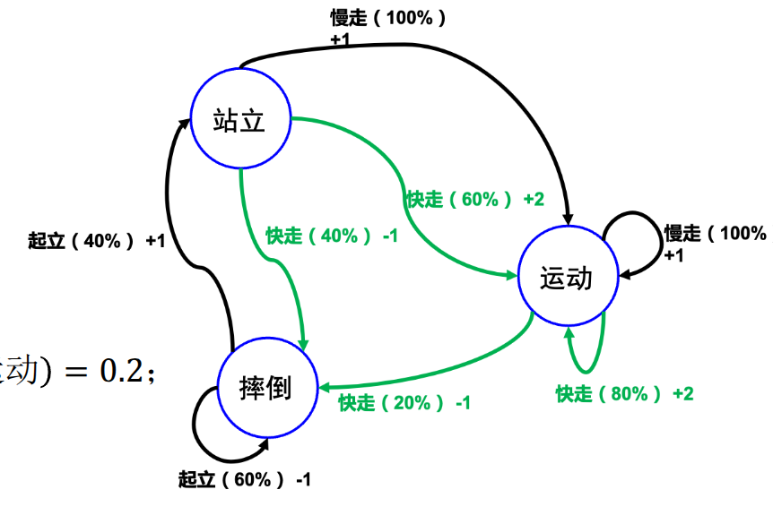
    - 则：
    $Q^\pi$ (运动，慢走) = $100\%*(1+0.95*1.4) = 2.33$
    $Q^\pi$ (运动，快走) = $80\%*(2+0.95*1.4) +20\%*(-1+0.95*0)= 2.464$
    $V$(运动) = $0.8*2.33+0.2*2.464=2.3568$
- **贝尔曼最优方程：** 在策略迭代中，我们仅对最优值感兴趣，而不是针对某个策略下的期望值感兴趣，因此在计算中，我们仅选择价值函数的最大值，即：
$V_*(s)=max_{a\in A}Q_*(s,a)$
$Q_*(s,a)=r(s,a)+\gamma\sum_{s'\in S}P(s'|s,a)V_*(s')$
$V_*(s)=max(r(s,a)+\gamma\sum_{s'\in S}P(s'|s,a)V_*(s'))$
$Q_*(s,a)=r(s,a)_\gamma\sum_{s'\in S}P(s'|s,a)\sum_{a'\in A}\pi(a'|s')max_{a'\in A}Q_*(s',a')$
    - 假设：
    $V$(站立) = $1$
    $V$(摔倒) = $0$
    $V$(运动) = $1.4$
    $\gamma$ = $0.95$
    $\pi$ (慢走|运动) = $0.8$
    $\pi$ (快走|运动) = $0.2$
    - 则：
    $Q^\pi$ (运动，慢走) = $100\%*(1+0.95*1.4) = 2.33$
    $Q^\pi$ (运动，快走) = $80\%*(2+0.95*1.4) +20\%*(-1+0.95*0)= 2.464$
    $V$(运动) = $max(2.33,2.464)=2.464$
- **POMDP建模：** 部分可观测马尔科夫决策过程$（Partially\ Observable\ Markov\ Decision\ 
Process）$是带有隐藏状态的MDP，是一个带有行为决策的隐马尔科夫模型。一个POMDP问题可以由 $𝑀 =< 𝑆, 𝐴, 𝑂, 𝑃, 𝑅, 𝑍, 𝛾 >$ 构成，其中：
    - $𝑆$ 是有限状态集合；
    - $𝐴$ 是有限行为集合；
    - $𝑂$ 为有限观测集合；
    - $𝑃$ 为状态转移函数：$P_{ss'}^a=P[S_{t+1}=s'|S_t=s,A_t=a]$;
    - $𝑅$为奖励函数：$R_s^a=E[R_{t+1}S_t=s,A_t=a]$
    - $𝑍$ 为基于状态𝑆的观测函数：$Z_{s',a}^a=P[O_{t+1}=o|S_{t+1}=s',A_t=a]$
    - $\gamma$ 为折扣系数，对未来奖励衰减。

### 
 动态规划 

- **概述**
    - 动态规划将复杂的多阶段决策问题分解为一系列简单的、离散的单阶段决策问题，采用顺序求解方法，通过求解一系列小问题达到求解整个问题的目的。
    - 动态规划的各个决策阶段不但要考虑本阶段的决策目标，还要兼顾整个决策过程的整体目标，从而实现整体的最优决策。

动态规划问题的主要要素为：
    - 一个状态取决于控制的离散时间动态系统。这里我们假设有 $n$ 个状态，分别表示为 $1,2,...n$ ，加终止状态0。在状态 $𝑖$ 的时候，控制行为可以从有限集 $𝐴(𝑖)$ 中获取。同时在状态 $𝑖$，采取行为 $𝑎$，进入状态 $𝑗$ 的概率可以表示为$p_{i,j}(a)$
    - 一个根据状态和行为所决定的可累计的奖励。在第$𝑘$步决策中，我们设定 $\gamma^kr(i,a,j)$ 为奖励，其中 $𝑟$ 是奖励函数，$\gamma$ 是惩罚长远奖励的折扣因子。
- **动态规划的结果：** 
    - 动态规划得到结果是策略 $(policies)$ ，即$\pi=(\mu_0,\mu_1,...)$，其中每一个$\mu_k$都是从一个状态到行为控制的映射。如果策略$\pi$已经确定，状态序列$i_k$即为马尔科夫连：$P(i_{k+1}=j|i_k=i)=p_{ij}(\mu_k(i))$
    - 对于有限视野的问题，即奖励在未来的有限步数内的累计$(N)$，对于一个策略 $\pi$ 和初始状态 $i$ ，其期望累计奖励为（其中$ \gamma^NV(i_N)$ 是视野中最终状态的终止奖励）
    $V_N^\pi(i)=E[\gamma^NV(i_N)+\sum_{k=0}^{N-1}\gamma^kr(i_k,\mu_k(i_k),i_{k+1}|i_0=i)]$
- **动态规划的具体过程：**
    - 一阶段决策$(N=1)$
    $V_1^*(i)=min_{\mu_0}\sum_{j=1}^np_{ij}(\mu_0(i))(r(i,\mu_0,j)+\gamma V(j))$
    $V_1^*(i)=min_{a\int A(i)}p_{ij}(a)(r(i,a,j)+\gamma V(j))$
    - ...
    - k阶段决策$ (N=k)$
    $V_0^*(i)=V(i)$
    $V_k^*(i)=min_{a\in A(i)}\sum_{j=1}^np_{ij}(a)(r(i,a,j)+\gamma V_{k-1}^*(j))$

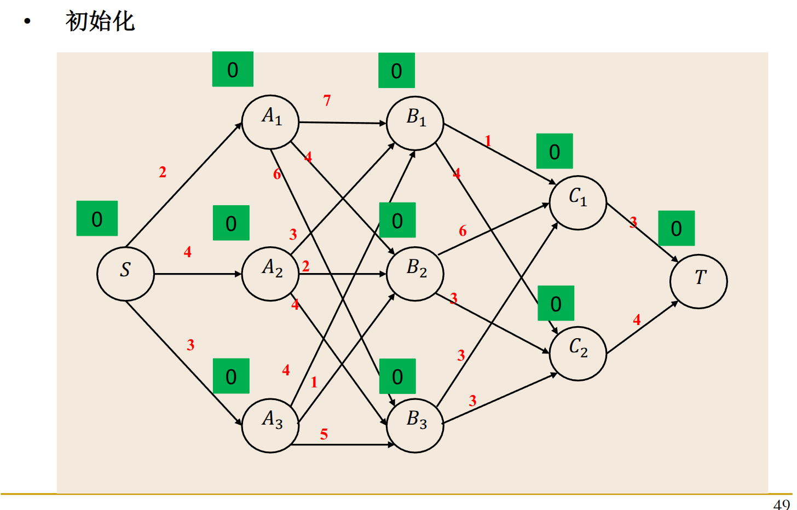
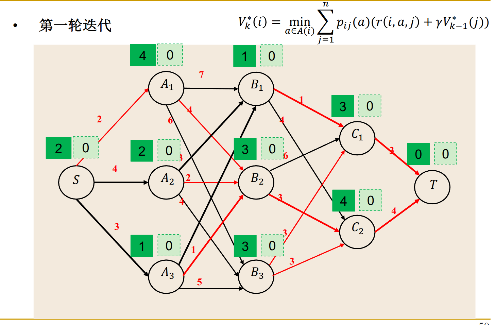
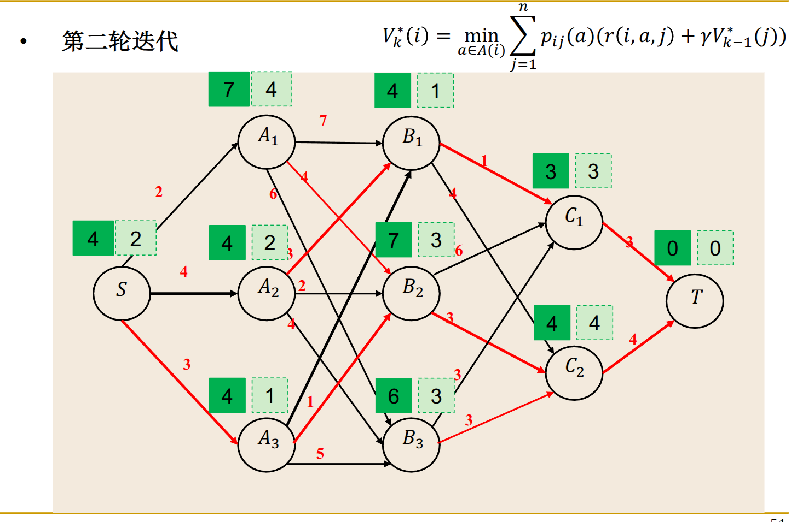

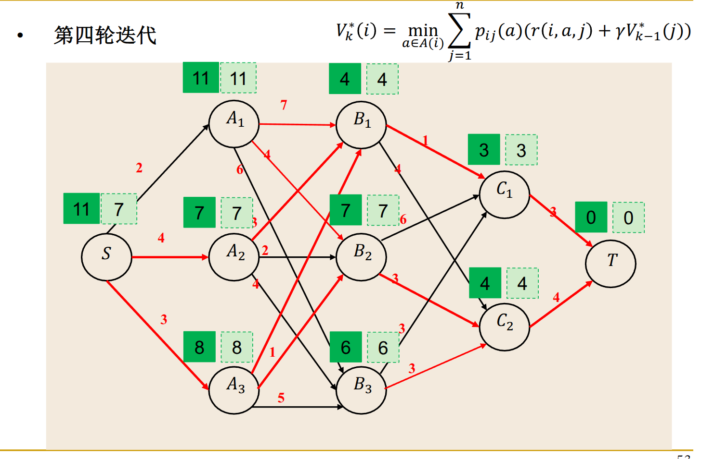
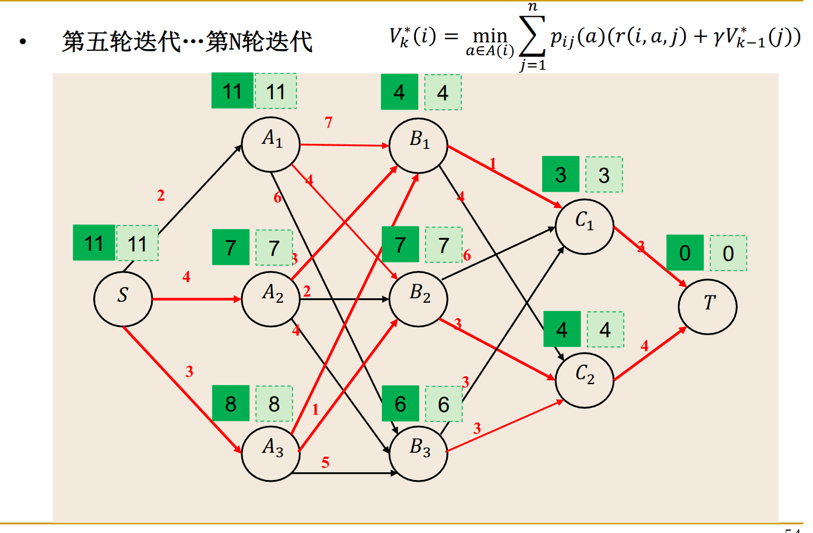
-  基于动态规划的强化学习算法主要有两种：策略迭代（policy iteration）和价值迭代（value iteration）。
- 其中，策略迭代由两部分组成：策略评估（policy evaluation）和策略提升（policy improvement）。
    - 策略迭代中的策略评估使用贝尔曼期望方程来得到一个策略的状态价值函数，这是一个动态规划的过程；
    - 而价值迭代直接使用贝尔曼最优方程来进行动态规划，得到最终的最优状态价值。
- **策略评估：** 对于给定的策略𝜋，策略评估用于计算状态价值函数：
- **策略优化：** 基于价值函数，策略优化通过更贪婪的行为生成更好的策略$\pi'\geq\pi$
- **策略迭代：** 一般策略迭代（Generalized Policy Iteration）算法指的是一个改进策略的迭代过程，它将策略评估和策略优化相结合：
    - 在GPI中，价值函数可以通过重复迭代来不断接近当前策略的实际值；策略也在此过程中不断接近最优策略；且总是可以收敛到最优策略。
    - 给定一个策略 $\pi$，如果采用贪婪的方式优化策略，即 $\pi^*=argmax_{a\in A}Q_\pi(s,a)$ 生成一个新的更优策略，这个改进的策略可以确保比原来的策略好,因为
    $Q_\pi(s,\pi^*(s))=Q_\pi(s,argmax_{a\in A}Q_\pi(s,a))$
    $=max_{a\in A}Q_\pi(s,a)$
    $\geq Q_\pi(s,\pi(s))$
    $=V_\pi(s)$
- **价值迭代：** 策略迭代中的策略评估需要进行很多轮才能收敛得到某一策略的状态函数，这往往需要很大的计算量。我们是否必须要完全等到策略评估完成后再进行策略提升呢？是否可能出现这样的情况：虽然状态价值函数还没有收敛，但是不论接下来怎么更新状态价值，策略提升得到的都是同一个策略。如果只在策略评估中进行一轮价值更新，然后直接根据更新后的价值进行策略提升，这样是否可以呢？
    - 价值迭代是一个动态规划过程：
    $V_*(s)=max_{a\in A}\{ r(s,a)+\gamma\sum_{s'\in S} P(s'|s,a)V_*(s')\}$
    - 将其写成迭代更新的方程为：
    $V_{t+1}(s)=max_{a\in A}\{ r(s,a)+\gamma\sum_{s'\in S} P(s'|s,a)V_t(s')\}$
    - 当 $V_{t+1}=V_t$ 时，该解就是贝尔曼最优方程的不动点，对应最优解的价值函数$V$。然后通过下式恢复最优策略
    $\pi(s)=argmax_a\{r(s,a)+\gamma\sum_{s'\in S}p(s'|s,a)V_{t+1}(s')\}$
- **收缩映射：**
    - 价值迭代的更新公式为：
    $V_{t+1}(s)=max_{a\in A}\{ r(s,a)+\gamma\sum_{s'\in S} P(s'|s,a)V_t(s')\}$
    - 将其定义为贝尔曼最优算子 $Τ$：
    $V_{t+1}(s)=TV_k(s)=max_{a\in A}\{ r(s,a)+\gamma\sum_{s'\in S} P(s'|s,a)V_t(s')\}$
    - 引入压缩算子：$O$ 是一个算子，如果满足$||OV-OV'||_q\leq||V-V'||_q$，则称 $O$ 是一个压缩算子；其中 $||x||_q$ 表示 $x$ 的 $L_q$ 范数，无穷范数为 $||X||_\infty=max_i|x_i|$!
    [alt text](PIC/image-13.png)
    - 则当$\gamma\leq 1$时：
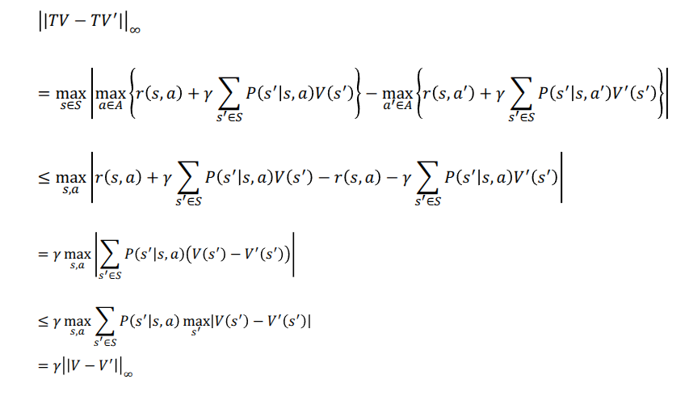
- **策略评估与优化：** 如果我们有环境的完整信息，那么问题就会转变成可以使用DP解决的动态规划问题。但不幸的是，大多数情况下，我们很难直接获取状态转移和奖励函数。虽然我们无法直接使用贝尔曼方程来解决MDP问题，但是它是强化学习的理论基础，策略评估与策略改进也是算法迭代的基础。

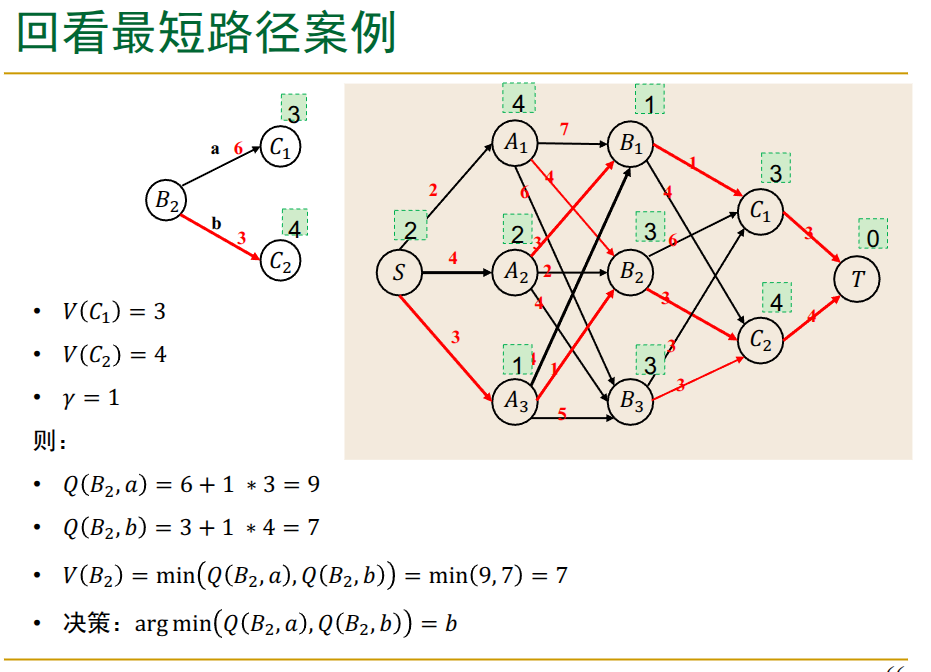
## 
 L2 Value Estimation 

### 
蒙特卡洛方法

#### 概述
- 在现实问题中，通常我们不能假设我们对环境有完全的了解，即无法明确地给出状态转移和奖励函数。因此我们需要一种直接从经验数据中学习价值和策略，无需构建马尔可夫决策过程模型的方法。
- 在这种情况下，智能体只能和环境进行交互，通过采样到的数据来学习，这类学习方法统称为无模型的强化学习（model-free reinforcement learning）。
- 蒙特卡洛方法是一种**基于随机采样和统计的方法**，得名于摩纳哥的蒙特卡洛赌场，因为这种方法**使用了大量的随机模拟**。蒙特卡洛方法在强化学习中的基本思想是**通过多次采样来估计状态或动作的值函数，随后利用值函数进行策略改进**
#### 蒙特卡洛方法
- 蒙特卡洛方法（Monte-Carlo methods，简称 MC）是一类广泛的计算算法。蒙特卡洛方法依赖重复随机抽样来获得数值结果。
- 例如：计算圆的面积

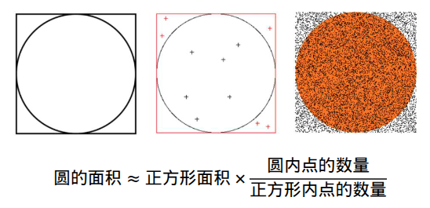
- 例如：AlphaGO中AI对围棋落子胜率的估计

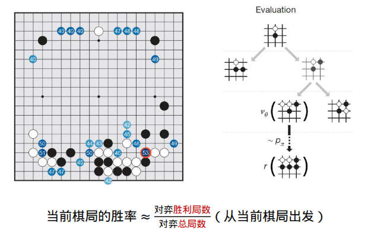

- 蒙特卡洛方法
    - 目标：从策略 $\pi$ 采样的历史经验中估计 $V^\pi$
    - 回顾设定：累积奖励 (return) 是总折扣奖励
    $G_t=R_{t+1}+\gamma R_{t+2}+...+\gamma^{T-1}R_T$
    - 回顾设定：值函数(Value function)是期望累积奖励
    $V^\pi(s)=E[R(s_0)+\gamma R(s_1)+\gamma^2 R(s_2)+...|s_0=s,\pi]$
    $=E[G_t|s_0=s,\pi]$
    $={1\over N}\sum_{i=1}^N G_t^i$
    - 蒙特卡洛方法使用策略π从状态s采样N个样本，并使用经验均值累计奖励近似期望累计奖励。
    - 具体实现：使用策略 $\pi$ 采样时间步数量为T的多个回合
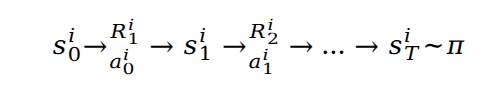
    - 对于每一个回合中的时间步 $t$ 中的状态 $s$
        - 更新访问次数$N(s)\leftarrow N(s)+1$
        - 更新return的总和$S(s)\leftarrow S(s)+G_t $
        - 估计return的均值$V(s)=S(s)/N(s)$
        - 由大数定律，当$N(s)\rightarrow \infty$有$V(s)\rightarrow V^\pi(s)$
    - 将公式整理为增量更新的形式，可得
    $N(s_t)\leftarrow N(s_t)+1$
    $V(s_t)\leftarrow V(s_t)+(G_t-V(s_t))/N(s_t)$
    - 增量式公式：
    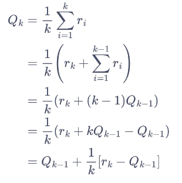
    - 对于非平稳环境（即环境的动态会随时发生变化），蒙特卡罗方法可以跟踪一个滑动窗口内的平均值$V(s_t)\leftarrow V(s_t)+\alpha(G_t-V(s_t))$
    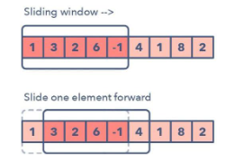
- 蒙特卡洛方法总结
    - 直接从经验回合进行学习，不需要模拟/搜索
    - 模型无关（model-free），无需环境信息
    - 核心思想简单直白：value = mean return
    - 使用完整回合进行更新：只能应用于有限长度的马尔可夫决策过程，即所有的回合都应有终止状态。

### 
时序差分方法

#### 概述
- 时序差分方法（ Temporal Difference methods，简称 TD）能够直接使用经验回合学习，同样也是模型无关的；观测值对未来的猜测
- 与蒙特卡洛方法不同，时序差分方法结合了自举（bootstrapping），能从不完整的回合中学习；
- 时序差分通过更新当前预测值，使之接近估计 return，而非真实 return
#### 时序差分方法 vs 蒙特卡罗方法
- 目标：从策略$\pi$采样的历史经验中估计$V^\pi$
- 蒙特卡罗方法更新值函数$V(s_t)$使其接近$G_t$:
$V(s_t)\leftarrow V(s_t)+\alpha(G_t-V(s_t))$
- 时序差分方法更新值函数$V(s_t)$使其接近$R_{t+1}+\gamma V(s_{t+1})$:
$V(s_t)\leftarrow V(s_t)+\alpha(R_{t+1}+\gamma V(s_{t+1}-V(s_t)))$
- $R_{t+1}+\gamma V(s_{t+1})$为时序差分目标
- $\delta_t=R_{t+1}=\gamma V(s_{t+1})-V(s_{t})$为时序差分误差

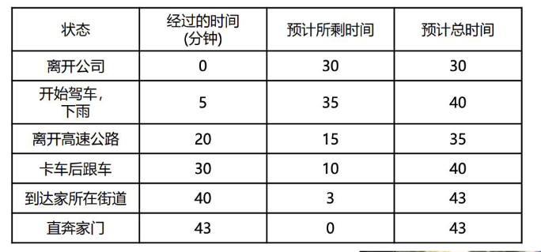
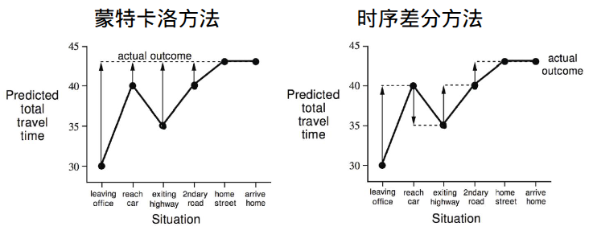

- 时序差分方法能够在每一步之后进行在线学习，蒙特
卡洛方法必须等待回合终止，直到累计奖励已知；
- 时序差分方法能够从不完整的序列中学习，蒙特卡洛
方法只能从完整序列中学习；
- 时序差分方法能够应用于无限长度的马尔可夫决策过
程，蒙特卡洛方法只适用于有限长度；
- 累积奖励$G_t=R_{t+1}+\gamma R_{t+2}+...+\gamma^{T+1}R_T$ 是的无偏估计
- 时序差分的真实目标$R_{t+1}(当前估计)+\gamma V^\pi(s_{t+1})$也是$V^\pi$的无偏估计
- 时序差分目标$R_{t+1}+\gamma V^\pi(s_{t+1})$是$V^\pi$的有偏估计
- 时序差分目标具有更低的方差，这是由于
    - 累积奖励取决于多步随机动作、状态转移和奖励
    - 时序差分取决于单步随机动作、状态转移和奖励

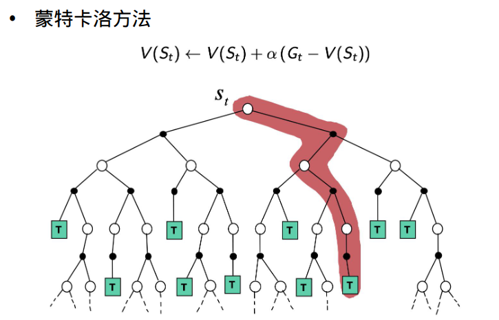
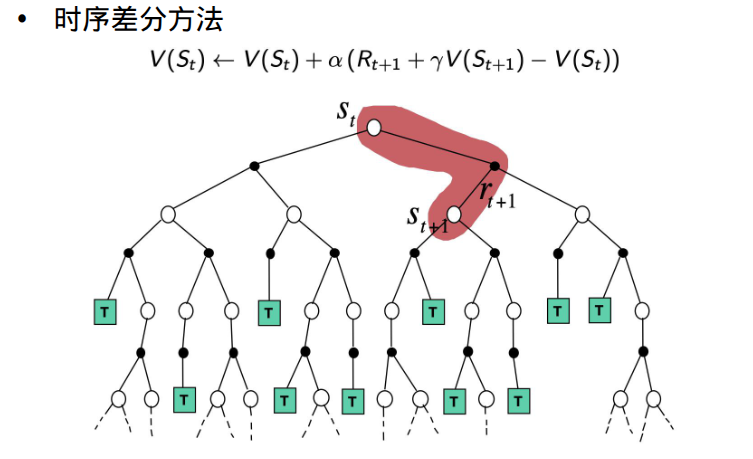

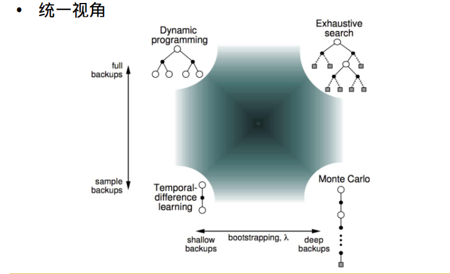
### 
资格迹方法

### 概述
- 蒙特卡洛方法（高方差，无偏差）
$V(S_t)\leftarrow V(S_t)+\alpha(G_t-V(S_t))$
$G_t=R_{t+1}+\gamma R_{t_2}+\gamma^2 R_{t+3}+...+\gamma^{T-t-1}R_T$
- 时序差分方法（低方差，有偏差）
$V(S_t)\leftarrow V(S_t)+\alpha(R_{t+1}+\gamma V(S_{t+1}-V(S_t))$
- 多步时序差分方法（介于蒙特卡洛和时序差分方法之间）

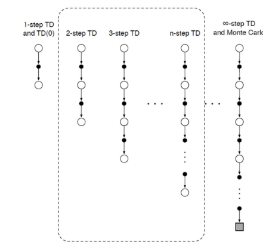
- 无限步时序差分方法等效于蒙特卡罗方法
- 为了实现方差与偏差的平衡，一种可行的方案是将蒙特卡洛方法与时序差分方法融合，实现多步时序差分；
    - 定义 n 步累积奖励：
    $G_t^n = R_{t+1}+\gamma R_{t+2}+... +\gamma^{n-1}R_{t+n}+\gamma^{n}V(s_{t+n})$
    - 可得出n步时序差分学习：
    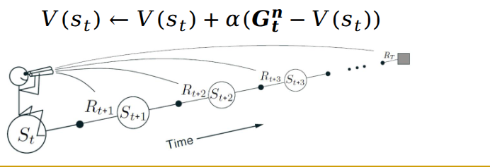
#### 资格迹方法
- 资格迹方法（Eligibility Traces methods）统一了时序差分和蒙特卡罗方法；
- 资格迹方法通常使用超参数$\lambda\in [0,1]$控制值估计蒙特卡罗还是时序差分，通常来说，当$\lambda=1$时资格迹方法等价于蒙特卡罗方法，当$\lambda=0$等价于时序差分方法；
- 介于两者之间的方法通常比任何一种极端方法都要好。
#### $TD-\lambda$
- $TD-\lambda$ 是一种比较常见的资格迹方法，不同时序差分估计值的权重随着其时间步的增加而衰减：
$G_t^n = R_{t+1}+\gamma R_{t+2}+... +\gamma^{n-1}R_{t+n}+\gamma^{n}V(s_{t+n})$
$G_t^\lambda=(1-\lambda)\sum_{n=1}^\infty \lambda^{n-1}G_t^n$
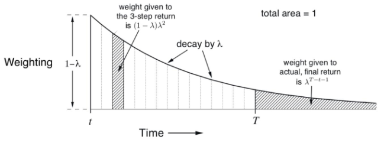
- $TD-\lambda$ 的前向视角
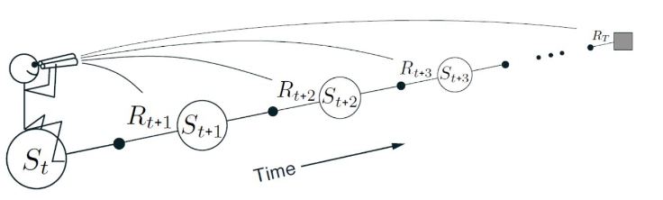
    - 朝着$G_t^\lambda$的方向更新函数；
    - 同盟各国观测未来的数据计算$G_t^\lambda$
    - 与蒙特卡洛方法类似，只能计算完成的回合
- $TD-\lambda$ 的后向视角
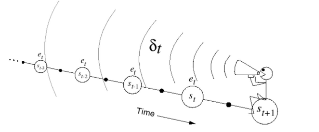
    - 对每个状态s保持资格迹
    - 更新每个状态s的价值函数
    - 与$TD-\lambda$和资格迹$E_t(s)$呈比例关系

### 
表格型时序差分方法

#### 概述
- 强化学习由策略评估和策略改进组成
- 策略评估的目标是知道什么决策是好的，即估计$V^\pi(s_t)$
- 策略提升的目标是根据值函数选择好的行动
- 基于 $V$ 函数

- 基于 $Q$ 函数
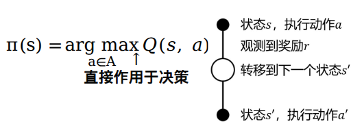
#### 表格型时序差分方法：SARSA
- SARSA是一种针对表格环境中的时序差分方法
- 对策略执行的每个（状态-动作-奖励-状态-动作）元组
- SARSA的策略评估为更新状态-动作值函数
$Q(s_t,a_t)\leftarrow Q(s_t,a_t)+\alpha(R_{t+1}+\gamma Q(s_{t+1},a_{t+1})-Q(s_t,a_t)))$
- SARSA的策略改进为 $\epsilon - greedy$

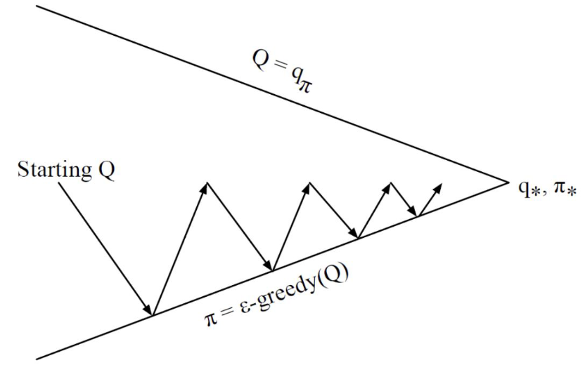

- 在线策略时序差分控制（on-policy TD control）使用当前策略进行动作采样，即SARSA算法中的两个动作“A”都是由当前策略选择的
#### SARSA示例：Windy Grid World
- 每步的奖励为-1，直到智能体抵达目标网格
- 折扣因子γ = 1

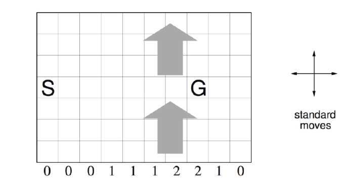
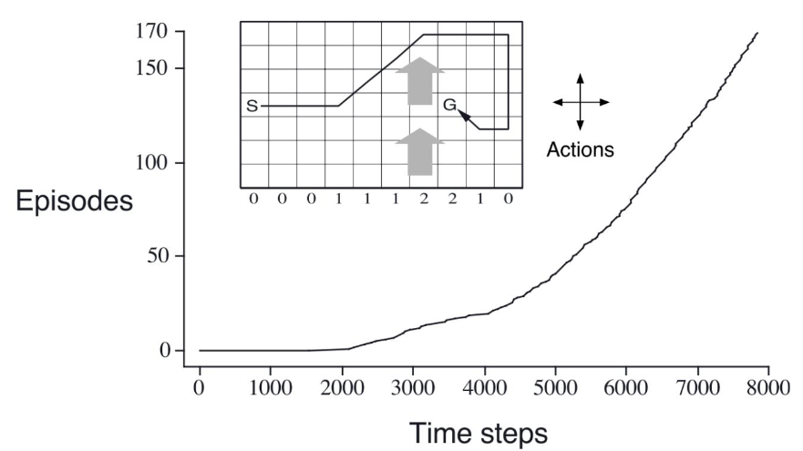
- 随着训练的进行，SARSA策略越来越快速地抵达目标
#### 表格型时序差分方法：Q-Learning
- Q-Learning学习状态动作值函数$Q(s,a)\in R$，是一种离线策略(off-policy)方法
- $Q(s_t,a_t)=\sum_{t=0}^T \gamma^t R(s_t,a_t),a_t \sim \mu(s_t)$
- 迭代式：$Q(s_t,a_t)=R(s_t,a_t)+\gamma Q(s_{t+1},a_{t+1})$
- 离线策略学习
    - 目标策略进行值函数评估或
    - 行为策略收集数据
- 为什么使用离线策略学习
    - 平衡探索（exploration）和利用（exploitation）
    - 通过观察人类或其他智能体学习策略
    - 重用旧策略所产生的经验
    - 遵循一个策略时学习多个策略
- 具体实现
    - 使用行为策略$\mu(\cdot|s_t)$选择动作$a_t$
    - 使用当前策略$\pi(\cdot|s_t+1)$选择后续动作$a'_{t+1}$，计算目标
    $Q'(s_t,a_t)=R_t+\gamma Q(s_{t+1},a'_{t+1})$
    - 使用时序差分更新$Q'(s_t,a_t)$的值以拟合目标状态-动作值$Q(s_t,a_t)\leftarrow Q(s_t,a_t)+\alpha(R_{t+1}+\gamma Q'(s_{t+1},a'_{t+1}-Q(s_t,a_t)))$
    - 目标策略 $\pi$ 是关于$Q(s,a)$的贪心策略
    $\pi(s_{t+1})=argmax_{a'}Q(s_{t+1},a'_{t+1})$
    - 行为策略是关于$Q(s,a)$的$\epsilon - greedy$策略
    - Q-学习目标函数可以简化为
    $Q'(s_t,a_t)=R_t+\gamma max_{a'}Q(s_{t+1},a'_{t+1})$
    - Q-学习更新方式
    $Q(s_t,a_t)\leftarrow Q(s_t,a_t)+\alpha(R_{t}+\gamma max_{a'}Q(s_{t+1},a'_{t+1}-Q(s_t,a_t)))$

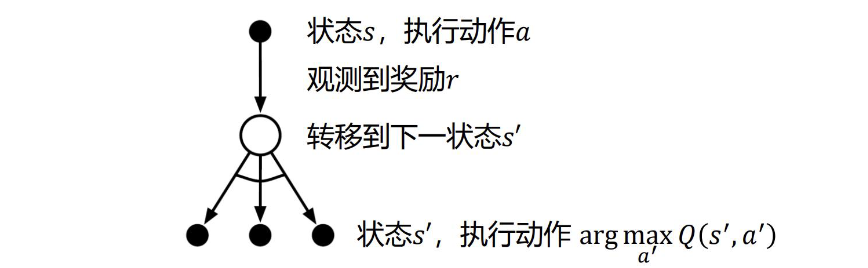
- 定理：Q-Learning能够收敛到最优状态-动作值函数 $Q(s_t,a_t)\rightarrow Q^*(s_t,a_t)$
- 回顾：收缩算子
- 定义H算子：$HQ(s_t,a_t)=R_t+\gamma E_{s_{t+1}\sim p(\cdot|s,a)}[max_{a'}Q(s_{t+1},a_{t+1})]$

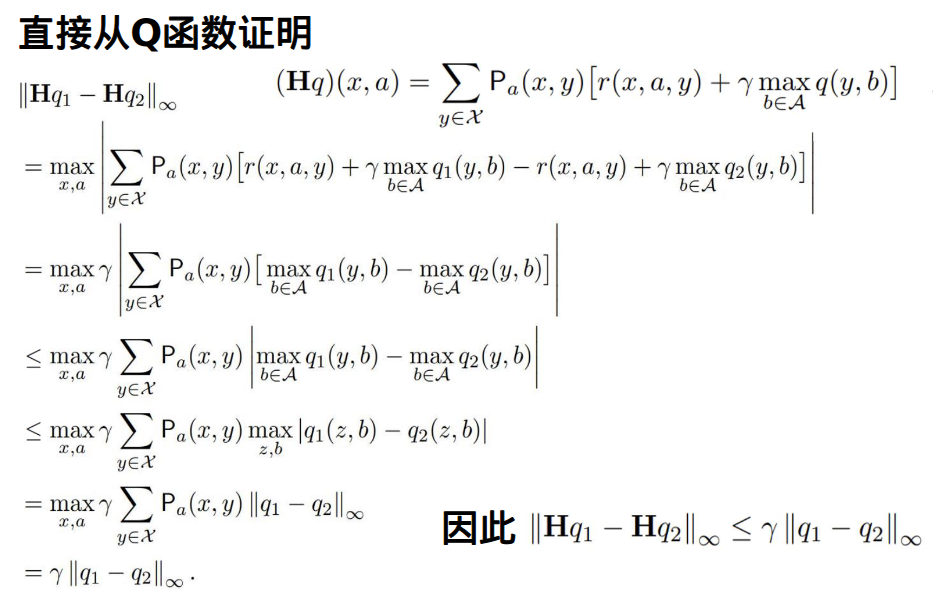

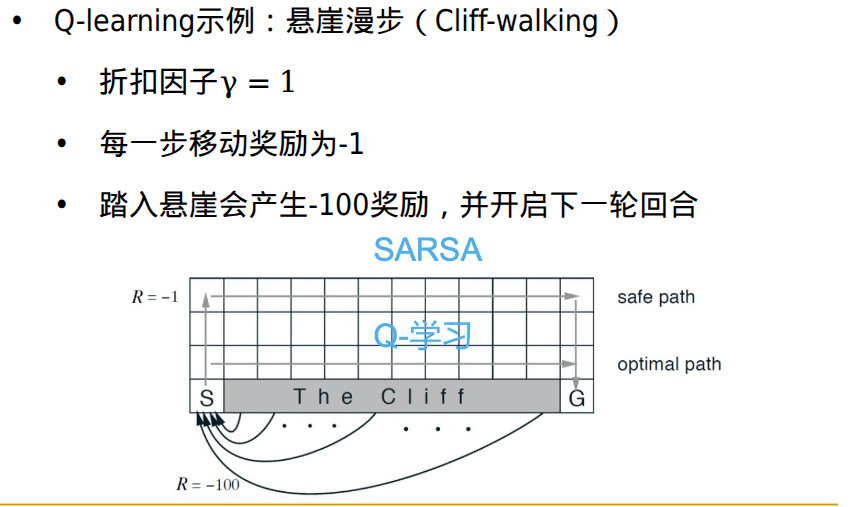
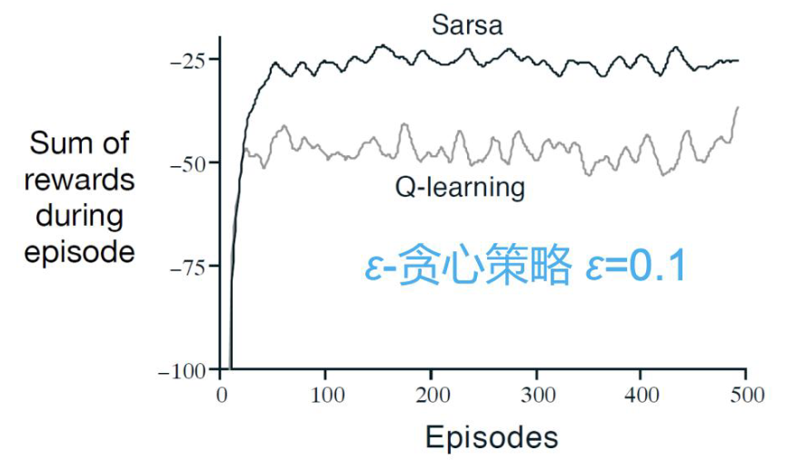